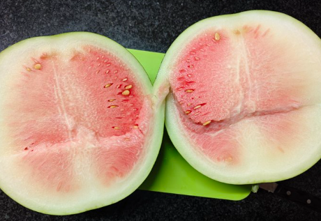
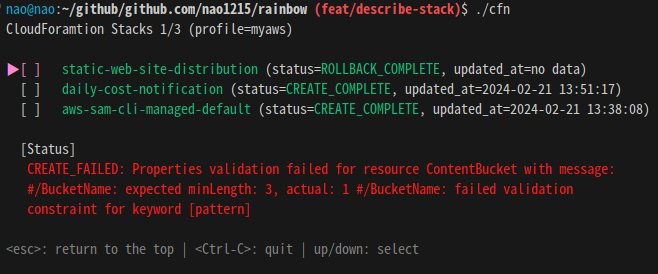

# 2025年

私の日記とOSS活動、家族をサポートする方法：[GitHub Sponsors](https://github.com/sponsors/nao1215)

## 2025年8月7日

[SNOW言語](https://github.com/nao1215/snow-toolchain)の初版ができた。[標準ライブラリ](https://github.com/nao1215/snow)は、Print関数しかない。技術ブログで[「夏休みの自由研究として自作プログラミング言語をClaudeでVibe Codingした話」](https://debimate.jp/2025/08/07/%e5%a4%8f%e4%bc%91%e3%81%bf%e3%81%ae%e8%87%aa%e7%94%b1%e7%a0%94%e7%a9%b6%e3%81%a7%e8%87%aa%e4%bd%9c%e3%83%97%e3%83%ad%e3%82%b0%e3%83%a9%e3%83%9f%e3%83%b3%e3%82%b0%e8%a8%80%e8%aa%9e%e3%82%92claude/)として感想文を書いたが、OCaml版のToolchainは捨てる。ClaudeでVibe Codingした結果、ゴミの山を作り上げてしまった。内部品質の低いコードの塊だ。品質を担保できるGolangで書き直す。今回は、青果物を捨てることになったが、Vibe Codingに関する経験を大きく詰めたのが収穫だった。

嫁と息子が帰ってきた。上越は雨が凄かったらしく、唇を紫にしながらプールで泳いだらしい。かなり怒っていることが伝わってきた。旅行の計画は念入りに組む必要があると学習した。

## 2025年8月6日

昨日の夕食には、幸楽苑を利用した。この幸楽苑は、私が子供の頃からあり、子供の頃にお子様ランチを食べて「（外食なのに）まっず」と思わせた店だ。外食が美味しくない可能性があると、私に学習させた。最近は値段が手頃かつ、嫁がにんにくバターらーめんを気に入っているので高頻度で利用している。この店舗は、必ずオーダーを間違える。お子様ランチのチャーハンとラーメンを取り違えたり、バターラーメンにバターが入っていなかったり、飲み物を間違えたり……必ず一つは間違えている。毎回、「今日は正しいオーダーで揃うかな？」と期待してしまう。

Claude Code Maxプラン（月100ドル）にアップグレードした。しかし、`Claude usage limit reached. Your limit will reset at...`がまだ登場する。そう、この日記はリセットの待ち時間に書いている。Claude先生のおかげで、SNOW言語は簡単なコードであればビルドできるようになった。標準出力もできる。基本的なサブコマンド（例：`snow fmt`）を作ったら、公開する予定だ。標準ライブラリは、コンパイラがないと何もできないので、さっさとパブリック公開した。SNOW言語は関数型言語なので、セルフホスティングを目指してもいいかもしれない。

嫁と息子が旅行へ行った。雨が降る予報だったが、晴れ間が見えている。バス乗り場が分からず、バスに乗れなかったらしい。次のバスに乗ったとのことだが、怒っていないか心配だ。自分は悠々とマクドナルドを食べてコーディングをしている。誰にも邪魔されない静かなコーディングは素晴らしい。進捗がガンガン出る。お酒飲みながらコーディングして、夕飯になか卯を食べて、お風呂に3回入るような平日は最高だ。誰にも邪魔されることはない。やはり、FIREを目指すべきかもしれない。独身のような気ままな生活を送りたいのとは、少し違う。いつもと違う体験がしたいのだ。家族と一緒にいる時間は大切だが、たまには一人で過ごす時間も必要だ。

## 2025年8月5日

自作言語コンパイラの実装が始まった。[GitHub Copilot](https://github.com/features/copilot?locale=ja)ではこの作業をやりきれないので、[Claude](https://claude.ai/)のProプランを導入した。会社でClaudeを使っているのでその実力は把握していたが、実装力とエラー発生時の突破力が高い。直ぐに`Claude usage limit reached. Your limit will reset at...`と表示されてしまった。今のところ、上位プランであるMaxプラン（100USD/月）を導入するほどではない。仕方がないので、日記を書いて時間を潰している。予想より実装の進みが早く、パーサーの実装まで突入できた。[LLM（Large Language Models）](https://ja.wikipedia.org/wiki/%E5%A4%A7%E8%A6%8F%E6%A8%A1%E8%A8%80%E8%AA%9E%E3%83%A2%E3%83%87%E3%83%AB)がここまで強力だと、将来のエンジニアはレビューマシンと化すかもしれない。しかし、そのレビューすらClaudeのほうが総合的に優れている。

自作言語を作ることになったキッカケは、関数型言語のエコシステムに不満があったからだ。文法は大して問題ではない。ビルドや配布に不満があった。Goのエコシステムを経験した後で、HaskellやOCamlを学ぶのは厳しいものがあった。そこで、Goのエコシステムを備えた関数型言語を作ろうと考えた。当初はOCamlの勉強用に、Bosse言語（ラクダのコブを意味するフランス語）を作っていた。Bosse言語は、Virtual Machineを導入する想定だったので、途中で「普及しづらいだろう」と考え直した。しかも開発中に風邪をひいて、検討し直す時間ができてしまった。結論として、折角実装するのであれば、少なからずユーザーを獲得できる言語を目指すべきだ。このような心境の変化があり、今は[LLVM](https://llvm.org/)を利用したSnow言語を作っている。

最近は、X（Twitter）が攻撃的すぎて見ていられない。政治的な内容は、結論ありきの発言や暴言を吐く人が多く、疲れてしまう。昔あった「くだらないインターネット感」が無くなってきて、みんな長文でキツめの主張をしている。自分が見たいのはオタクカルチャーなんだ。しかし、TimeLineに流れてこない。X（Twitter）を使う理由は、知り合いのポストが見たいからであって、それ以外の主張は読みたくない。期待していたmixi2が対して流行らなかったので、Xに留まっている感じだ。せめてもの抵抗で、私はポストせずに日記として意見を残すことにした。稀にXへポストするときもあるが。

## 2025年8月4日

自作言語コンパイラ実装のため、4日間の休みを得た。この期間にゴリゴリ実装する。[LLVM](https://llvm.org/)を使う手前までは実装したい。8/6〜8/7は、警報級の大雨が降るらしいので、嫁と子供が旅行を楽しめるかが分からない。

## 2025年8月3日

自室の床に、大きい傷が入っているのを見つけてしまった。息子のベッドが壊れた時の板を取っておいたのだが、その板が傷をつけたのだと思う。角度によっては傷が見えないが、丁度座っている角度から目に入るので「ああ、傷をつけてしまった」と落ち込んでしまう。まだ新築二年目なのだが。

長岡花火が昨日と本日、開催されている。フラー株式会社の現地組は、暑い中でキッチリ運営していることだろう。X（Twitter）で流れてくる花火の写真を見るだけでも見事なものだ。今年は、ドローンイルミネーションが登場したようで、遂に新潟でそんなものを使うようになったのかと感動してしまった。長岡花火は新潟で行われるイベントの中で全国規模なので、最先端を追従する方なのだろう。

昨日考えたが、インデックス積立+配当株の構成で投資をしているので、配当は旅費や趣味に使って良いのではないか。ひたすらお金を貯める人生はつまらない。家族のために使った方が良い。現在は年間10万円程度の配当だが、年間30万程度まで成長させれば、家族で旅行も行ける。将来的には50万円のPCを買える状態にしたいが、2000万ぐらい配当株に突っ込む必要がある。NISA（オルカン）優先で埋めていくので、40代以降に高配当株で全力を出すことになるだろう。息子が8歳〜9歳ぐらいになってからが本番だ。まずは旅費に困らないようにしたいので、年間20万円を目指したい。600万〜700万程度を配当株に投入する必要がある。計算してみると、現在は利回りが低そうだった。配当利回りが4%程度の株も多めに買わないとダメそう。収入が上がるとまた別な戦略が取れるが、増税や仕事負荷を考えると、そこまで全力で稼ぎたくない。

## 2025年8月2日

夏休みに備えて[上越国際プレイランド](https://jkokusai.co.jp/)を予約した。ここは温泉、プール、縁日が魅力的なところで、私はプールに興味がないのでお留守番することにした。予約を取ってから予約日の前後が雨の予報なことに気づいて、これは失敗したと思った。土砂降りでなければいいが。なお、嫁は「[上越科学館](https://jscience.jp/)で（息子のために）恐竜を見たい」と話していた。同じ上越でも距離があることを教えたら、納得していた。

約2日間、自由な時間が与えられたので、この期間に自作言語の仕様を日本語で書ききる。仕様さえ書ききってしまえば、それを翻訳したり、LLMに実装させたりして、作業を進めることができる。遊びに行かないのは旅費の節約の観点もあるのだが、わざわざ行きたくない場所へ出かけたくない気持ちもある。自宅でゆっくりして、外食する程度が丁度よい。寿司でも食べたい。新潟駅まで繰り出すかどうかだ。近所に海鮮屋はない。下手すると、すき家を食べて終わってしまう。

[みどりと森の運動公園](https://niigata.mypl.net/article/park_niigata/11190)で息子が自転車に乗っていた。大人（私と私の父親）は日陰を目指して移動していた。外で遊ぶ気温ではないと思う。とはいえ、33度だ。気温は低い方と言える。田んぼがある方向からくる風は冷たくて気持ちが良かった。近くにあった木には、セミの抜け殻があった。木の葉っぱの先に沢山くっついていた。セミは、木の幹で羽化して羽を乾かすと思っていたが、葉っぱの先でも羽化するのだなと驚いた。時間をかけて移動しているのだろう。息子は、セミの抜け殻を見つけると嫌がっていた。セミ本体を見つけたら後ずさりしていた。

今日息子は4回ぐらいお漏らしをしていた。勢い良くオシッコがパンツから吹き出していた。流石に最後の時は怒った。今年の4月ぐらいからお漏らしするようになったので困っている。2歳の時にトイレコントロールできていたのに、3歳になって漏らす頻度が上がった。何か要因があるのだろうか。

## 2025年8月1日

前々職の後輩から急に食事のお誘いがあった。この後輩は前職に誘ったこともあるが、そこまで深い間柄ではない。壺でも買わされるか、それともスカウトがあるか、良い転職先を聞かれるかだと思ってる。単純に情報収集するためだけに、食事のお誘いをする可能性は低いと思う。

息子とお出かけに行ったら途中でトイレに行きたがったので、駅に逃げ込むことにした。新潟駅まで行って本屋を覗いたが、コンパイラに関する書籍が少なかった。絵本も、これだ！というものがなかった。息子がオニギリとどら焼きを要求したので、それを買って帰った。どら焼きは夕ご飯の後だと伝えたら、泣いていた。そういえば今日は、初めて息子が公文式に行った。キチンと座っていられたのだろうか。やる気はあったらしい。

## 2025年7月31日

両親に庭のスイカを収穫しろと言われて、収穫後に中身を見たら何と白かった。未熟果だったので白い。調べて分かったことだが、つるの巻きひげ（スイカの付け根のヒゲ）が枯れているかどうかで、成熟度合いが判断できるらしい。他にも、叩いたときにボンボンと響く音なら熟してる。人工受粉させたり、水分量をコントロールすることで、しっかりとした実になって甘くなるらしい。スイカは日照量も大事で、1日6時間以上の日照が必要らしい。鳥に食べられないように葉っぱで隠していたのがマズかったかもしれない。つるの伸び方が半端ないので、来年はスイカを育てない予定。

来週は休暇を取って、どこかに出かける予定だ。ホテルを取る可能性がある。嫁と息子だけお出かけして、自分は家で一人でコーディングしていたい。夕飯に、寿司を食べに行ったり、自由気ままに過ごしたい。一人家に残ることで、家事が溜まらないのもポイントだ。今回はプールがついているホテルに泊まる可能性が高いが、自分はプールに入りたくないので、なおさら行くモチベが低い。

## 2025年7月30日

息子が歯を磨きながらベッドに転がり込んだので、自分と嫁が驚いた声を出したので、息子が泣き始めた。一息ついて、夕飯を食べた息子が飲み物を飲みながら椅子に座ろうとして、椅子が後ろに動いて転んだ。コップの水を顔に引っ掛けて泣いていた。泣いた後に、私がベリーを皿に移していたら、「自分がやりたかったのに」と泣き始めた。身体は大きくなったが、中身は子供だ。

自作関数型言語のプリミティブ型について、仕様書を書いていた。OCaml、Go、Rustのプリミティブ型から強い影響を受けていることが読み取れる。エラーハンドリングに関しては、Rustが最も優れていると感じている。時点がOCamlだが、OCamlは記法が独特で見た目が好みではない。もう少し頑張って仕様を決めたかったが、エアロバイクを漕いだ後なので元気がなかった。

来週は、息子と遠出したいが、どこに行くか迷う。まず、泊まりで出かけるかどうかで迷う。

## 2025年7月29日

肉（ソーセージ）を食べてから冷たい物を食べると、気持ち悪さが込み上げてくる確率が上がった。脂が体内で急速に冷やされることが原因と思われる。もう歳なので肉を食べなければいい。肉を断つことはできていないが、外食で小盛を頼むムーブを最近している。腹八分目はダメージが少ない。そう言えばお昼休みに、歯の黄ばみが気になった。もはや白い部分はない。コーヒーを飲むのを止めるか。対策するにしてもホワイトニングの歯磨き粉では、限界がありそう。

フラー株式会社の株価が5,000円を超え、本日時点でも4,500円を超えていて、かなり高値圏を推移している。受託商売は売り上げがスケールしないので、徐々に株価が落ち着くと予想している。この間調べたが、ストックオプションで一儲けするには立ち上げに安い行使価格で株を買えるようにするか、万単位の株が必要。儲けは基本的に給与所得扱いになるので、所得税と住民税で最大55%持っていかれてしまう。税金を考慮すると、数百株程度では売り抜けるタイミングが難しい。多くの株を持っている経営陣（初期メンバ）は株を気軽に売れないので、給与が高い方が好ましいんだなと思った。

息子が[新潟県立自然科学館](https://www.sciencemuseum.jp/event/detail/863)で恐竜の芝居を4回見たらしい。リニアカー模型を何度も動かしたり、電気椅子（?）に座ったりと、楽しそうだったらしい。嫁は同じところにずっと居て疲れたとのこと。

## 2025年7月28日

クレカ支払いやローン支払い、光熱費などの支払いで53万吹っ飛んだ。クレカ支払いが徐々に増えている。税金（単発）や月一出社の出張費でクレカ支払いが膨れているので、徐々に少なくしていきたい。しかし、今月のクレカ利用料が先月を超えている。Amazonプライムデーのせいだ。使いすぎだ。ちなみに、プライムデーで買った圧力鍋（T-fal）は良い活躍をしている。

昨日の夜、「[黒月のイェルクナハト](https://www.amazon.co.jp/%E9%BB%92%E6%9C%88%E3%81%AE%E3%82%A4%E3%82%A7%E3%83%AB%E3%82%AF%E3%83%8A%E3%83%8F%E3%83%88-1-KC%E3%83%87%E3%83%A9%E3%83%83%E3%82%AF%E3%82%B9-%E3%82%B9%E3%82%BA%E3%83%A2%E3%83%88-%E3%82%B3%E3%82%A6/dp/4065400759)」を読んだ。月姫を令和に再構築したという評判を目にしたが、平成初期～中期の雰囲気を感じた。ノリが古いのかもしれない。中二病を患っている時であれば楽しく読めたであろう。乳首ピアス（性癖）だけ、やたら現代的な気がした。

自作言語の仕様を考えると、「このミニマムな仕様で開発する意義はあるのか」と考えてしまう。開発規模が大きいので、なかなかやる気が起きない。Goのようなエコシステムを持つ関数型言語を作りたい。

## 2025年7月27日
日記を再開した。日記を継続しやすくするには、スマホから書きやすい状態にした方が良い。そこで、シングルファイルに日記を書くことにした。数年前は日付ごとに新規ファイルを作成していたが、この運用はPCを使わないと面倒臭かった。今まではX（Twitter）が日記替わりであったが、Xは攻撃的な世界になった。あそこに身を置く時間を減らしたい。そう考えた時、自分にとって便利なSNSはGitHubなので、GitHubに日記を書くのがベターだと判断した。本日より前の日記は思い出しながら、今日書いた。  

クーラーが設置された。ついでに使っていないPCやモニタを片付けたら、机の上がスッキリした。L字の机と、もう一つ机をくっつけているので、大分机が広い。今日は冷やし中華とピザを作って、スイカを切った。ピザを作る速度が段々上がってきた。「ぼくの考える最強のエコシステムを持つ関数型言語」を作ろうと考えているが、利用予定言語のOCamlに慣れていないので、進まない。Goを使ってしまうか。最近はLLMの話題が多すぎて、話題にならない領域（自作言語）で遊ぼうと考えている。Vibe Codingの話題を積極的に触れたくない。 

## 2025年7月26日
東京から帰ってくると、毎回新潟駅で[生キャラメルの羊羹](https://o-hyakkaen.com/lineup/nama-caramel_youkan/)を買っている。東京で買わない理由は、早朝に帰宅すると東京駅の店が開いていないからだ。私は、この羊羹を邪道だと思っている。とらやの羊羹と比較すると、軟弱な感じがする。アンコが重い方が好みだ。嫁は、この羊羹を絶賛しており、音楽性の違いを感じる。  

なか卯、丸亀製麺、すき家を利用した。疲れてて、料理する気がなかった。この辺りのチェーン店は食べ飽きてしまったので、他のお店が近所にできると嬉しい。

## 2025年7月25日
株式会社カンムの総会で、チームビルディング中といった趣であった。懇親会中に咳が止まらなくて困った。東京で飲み会すると、食事と酒のランクが新潟と比較して数段落ちる。土地代が高いのだろうなと感じる。新潟は素材に予算が反映されている。新潟の居酒屋が好きだが、最近行く機会が減ってしまった。現職では月に一度の東京出社が必要で、飲み会を考慮して一泊している。最強のビジネスホテルを探しているが、そんなものはないのかもしれない。身体が痒くなるベッドだけは勘弁願いたい。

## 2025年7月24日
フラー株式会社の上場パーティーに参加した。辞めた立場だが、パーティーにふらっと参加できたことには感謝したい。経営者サイドは、やはり退職者が出ると悲しくなるものなのだなと、スピーチを聞いて思った。社長がダルマの目を書くときに筆ペンが出なくてサインペンを使ったり、板チョコでポッキーゲームしていたりと、愉快なパーティーだった。フラーには、新潟のIT企業でトップクラスの規模感まで成長してもらいたい。

# 2024年
## 2024年3月31日
AWS SAA受かった。手応えはあったが、そこまで得点は高くなかった。切り替えて次の試験を合格するぞ。

## 2024年3月30日
AWS試験の前日なので、皿洗い、洗濯2回、洗濯物を畳んで息子と2時間以上散歩、夕食の買い出しをしてから勉強開始した。
頭が回らない状態で試験に挑むのは嫌なので、早めに寝た。が、嫁がバカでかい声で通話していたので、入眠に時間がかかった。

## 2024年3月29日
AWS勉強をしたが、段々と問題文が長くなってきたので捗らなかった。問題文の細部まで気を配らないと間違うので、疲れる。

ことこと（惣菜屋）で弁当を買ったら、10% OFFにならなかった。
幽霊塔を最後まで読んで、現代的なテーマだと思った。性自認に関する話を財宝と絡めてキレイにまとめていた。

## 2024年3月28日
午後休暇を取ると思いたち、コアタイムに帰るに格下げし、最終的には休み休み22時まで働いてしまった。意外とコミュニケーションに時間がかかるものだ。

## 2024年3月27日
昨日AWSの勉強できなかったので、今日は多めにした。咳がまだ止まらず辛い。

## 2024年3月26日
咳が止まらずダウン。薬を買ったが効かない。

## 2024年3月25日
咳が止まらない。今日はAWS勉強を淡々とやった。風呂に長時間入ったのでスッキリした。NISAのポイント投資はオルカンに切り替えた。額が小さすぎて、火遊びしても面白くない。そのため、オルカンで淡々と貯めることにした。

## 2024年3月24日
息子と新潟大学前駅へ行って「電車に乗らないよ」と伝えたら、「ない……（のり）たい!」と泣き始めた。エレベーターで下に降りたら、再度階段で駆け上って電車に乗りたそうにしていた。

AWS試験勉強がギリギリ終わった。もう2週間欲しい。昨日からgupコマンドにPRが連続で来て、少し動作が速くなった気がする。

## 2024年3月23日
息子が「大丈夫」と言ってくれるようになった。若干オウム返しのように聞こえるが。

テックリードのOSSに欲しい機能を提案した。自分で実装しても良いが、来月にならないと時間ができない。

## 2024年3月22日
コミュニケーションにコストを払って開発しなければならないと感じた。多くの人と上手く会話できていない。自分の考えている設計をテキストで丁寧に示す必要がある。
仕事が回っていないので稼働時間を増やしたいが、家事と育児が回らなくなるジレンマがある。

note株式会社から2回スカウト連絡が来たので、求人情報と技術記事を読んでから回答した。現職のように開発言語が一つだけのサーバーサイドは、求人を見る限り珍しい。note株式会社は、複数の開発言語を取り扱っていた。

## 2024年3月21日
前日を休みにあてたので、体力が有り余った。しかし、残業が多くて体力を消耗してしまった。どの案件もレビューが多く、集中力を使う。正直なところ、ミスも増えている気がする。コードも書いているが、パッと書けなくなってきた。それでも大分スピードが速い。

夜は疲れてマクドナルドに行った。ポテトL、倍ビックマック、パイで1100円ぐらいした。高い。ビックマックが高い。600円以上した。
今日は、オルカンが最高値を更新して、2.5％ぐらい上がっていた。正直なところ、一回ガクッと下がって欲しい。

## 2024年3月20日
今日の朝は目覚めが悪かった。祝日で助かった。息子と内野駅まで散歩に行った。日清ラ王が「袋麺を5食-->3食にした」とCMしていたが、ステルス値上げすればいいのに何故CMにしたのかと感じてしまった。
AWS勉強中に激しい睡魔に襲われたので早めに昼寝した。あまり深く寝れなかった。

砂肝を細かく切って下味を付けてから野菜炒めに投入すると、美味しい。コスパが良い。ただし、脂がないので野菜炒めに旨味が映らない。
NISAの成長投資枠をニッセイSOXから別な銘柄に移そうかと悩み中。半導体は浮き沈みが激しく、ボラティリティが高い。メンタルに良くない。FANGあたりに変更する。

## 2024年3月19日
仕事の波が一日の中でコントロールできず、残業時間が無駄に増えている。一回、仕事の棚卸しをしたほうが良さそうだ。頑張ってAWS SAAの基礎問題が終わったので、残りは模擬試験をやり込むだけ。

## 2024年3月18日
[いのまたむつみ](https://www.oricon.co.jp/news/2318961/full/)が逝去され、悲しい。中学生の頃にテイルズオブデスティニー2で初めてその絵に触れたが、独特な絵柄で好きだった。

Go 1.22リリースパーティーを見たが、今は心がAWSにあるので面白みを感じなかった。さっさとAWSの勉強を終わらせてGoに戻りたい。

## 2024年3月17日
N度目の「痩せるか」を心に秘め、お菓子を買うのを止めようと考えた。お菓子やジュースを買わずに、投資に入金する。楽天ウォレットの開設も依頼を出した。既に仮想通貨は値段が高いので、遊び半分で試す。

AWSの勉強が順調に遅れている。進捗を出したいが、花粉の影響で怠さがある。

息子に単語カードの読み聞かせをしたら、復唱するようになってきて安心した。まだ言えない言葉が多い。

## 2024年3月16日
前職の同期の結婚式に出席した。会社は違うが、自分は同僚として呼ばれていた。三次会まで飲んだのは久しぶりだが、21時前には切り止めて帰った。みんな家庭を持ち始めて、全員が集まれる時間が少なくなってきた。次の集まりも、誰かの結婚式かもしれない。

## 2024年3月15日
今日は、息子のお楽しみ会だった。保育園につくと、息子は普段と違う雰囲気を感じ取ったのか、顔つきが険しくなった。写真を撮る時は、顔を上げてくれず、嫁の胸に顔を埋めていた。

名前を呼ばれたときのお返事もできなかったし、ダンスもできなかった。ずっと嫁の膝の上にいた。私も子供の頃のお遊戯会でずっと泣いていたのを思い出した。あれは多分3歳ぐらいの時だろう。最後に端っこで立った筈だが、殆ど母親の近くで泣いていた気がする。

息子は、工作の時間になったら夢中になって作業をしていた。名前シールを貼らせようと思ったら、イヤイヤをされた。貼る順番があったらしい。小さいシールから順に貼りたかったのだろう。

帰宅したら、早めに仕事を切り止めようかと思ったが、そうはいかなかった。複数のレビューが飛んできたので、その作業に追われていた。疲れたのでマクドナルドでご飯を食べようとしたら、障害で電子マネーが使えなかった。非常に残念だった。

## 2024年3月14日
息子は友達に「ごめんなさい」をしようかと促された時に、正反対の方を見たり、目をつぶって時間が過ぎるのを待っているらしい。あまりよろしくないので、教育的な指導が必要だと思う。

小遣い程度の金額でSOXインデックスを買った。SOXは、半導体銘柄を扱っているので、下げ相場が来るだろう。2年後ぐらいに下がると推測している。中国が国内で半導体材料を集めているそうなので、アメリカの半導体がそこまで伸びるとは思っていない。微細化技術は、アジア人の方が得意だと思う。

## 2024年3月13日
残業を2hする日が増えてきた。誰にも頼まれていない業務を自分のために進めているので、残業はその業務分だと思われる。残業してから資格勉強を続けると、日中の体調が悪い。花粉症もダブルパンチで、倦怠感がある。

今日は息子のテンションがおかしく、顔が赤かったので風邪で興奮していたかもしれない。夕ご飯をパクパク食べてくれないので、困りもの。寝る時も、眠いのに遊んでいる。寝かしつけの時、私が意識を失いそうなのを察してか、息子は急に寝た。

## 2024年3月12日
残業が少しずつ増えてきた。頭のリソースを使う作業が多く、「今から頑張るぞ〜」というタメが必要になってきた。

ロシア国内のチケットを買う時、日本発行のカードが使えずに支払いができなかった。面倒なことだ。

今年はインフラを頑張る年になりそうだ。まずは足がかりとなるガイドラインを作り始めた。

## 2024年3月11日
AWS資格の勉強を22時から開始すると、船を漕ぎながら問題に取り組むことになる。一発で合格したい。

「みことちゃんは嫌われたくない!」を読むとメンヘラが良いのか、顔が良いキャラが良いのか分からなくなってくる。

祝福（YOASOBI）初めて聞いたけど、アレンジ凝りまくってて驚いてしまった。これは良い曲だ。

## 2024年3月10日
今日は、嫁と息子が居ない期間の予定を考えていた。コードを書くよりも、AWS資格を取った方がコスパが良さそうなので3〜4個の資格を取ることに決めた。SAA-C03 (3/31)、DVA-C02 (4/13、再受験無料) に申し込みをした。SAAは一度で受からなければならないので、今から勉強したい。

OCamlでシステムプログラミングをしていると、参考文献が少なくて辛い。もうRustを使うことに決めた。RustとGoで生きていこうと思う。

## 2024年3月9日
髪の毛を切ったが、ハゲてきた。姪と甥に会ったが、甥に睨まれまくった。唇を尖らせて終始不満顔だった。息子が同じような感情表現しないから、見てて面白い。姪は、コイキング知っていてビビった。ポケモン（アニメ）を最初から見ているらしい。

銭湯に行ったが、休日は人が多くて体験が悪い。

物理キーボードスマホが欲しすぎて、Unihertz Wishlist Surveyに「SoC強くして！」「キータッチ頑張って！」「あなた達しか作れないの！頑張って！」と要望を送った本音を言えばカメラ性能も上げて欲しかったけど、まずはリリースして欲しいから応援メッセージも含めた。新型出して欲しい

## 2024年3月8日
鳥山 明氏が逝去した。言わずと知れたドラゴンボールの作者である。自分の小学生時代は、ドラゴンボールが占める割合が大きかった。お小遣いがなかったので、お年玉を切り崩しながらドラゴンボールの単行本を買っていた。BOOKOFFで105円（当時は消費税が5%）を買い漁っていたので、お目当ての巻がなく、飛び飛びで購入して読んでいた。小学4年生の時に全巻（42巻）集めたような記憶があるが、もう少し後かも知れない。

小学生の時は、スーパーファミコンの超武闘伝1〜3、ハイパーディメンション、超悟空伝を友達とプレイしたので、思い入れがある。中学生以降はドラクエにも触れたし、大人になってからはドラゴンボール超 ブロリー（映画）で久しぶりにドラゴンボールの面白さに浸った。既に、ドラゴンボールとはコンテンツであり、鳥山 明氏が居なくても関連作品がリリースされるだろう。しかし、鳥山 明氏が書いた新しい絵が見れないのは残念だ。

30代になってから、BUCK-TICKの櫻井 敦司氏、X JAPANのHEATH氏、メタルと親和性の高かった八代 亜紀氏が立て続けに亡くなった。音楽の分野で訃報が続いたが、漫画の分野でも訃報が聞こえ始めた。悲しいことだが、30代は自分の知っている人が亡くなる時期なのかも知れない。90代まで生きる人もいるが、当然50代で亡くなる人もいるのだ。もっと早い人もいる。この事実を強く意識したのは、30代になってからだった。

## 2024年3月7日
前日に頑張りすぎて、今日は非常に眠かった。コアタイム後に昼寝をしてから社外MTGに挑んだら、呂律が回らなかった。
久しぶりに物理キーボードスマホが欲しい熱が再燃した。[The Minimal Companyの｢MINIMAL｣](https://www.gizmodo.jp/2024/01/the-minimal-company-smartphone.html)が2024年の最新だが、E Inkスマホは流石に攻め過ぎだと思う。スマホとしての機能を求めるならば、Unihertzの[Titan Slim](https://www.unihertz.com/ja-jp/products/titan-slim)が本命だ。しかし、SoCがHelio P70で、2022年のリリース当初から化石のようなSoCと評されていた。もう少し性能を上げて欲しい。また、ビルドクオリティが低いことも気になっているので、次の新製品を待ちたい。

## 2024年3月6日
急に日程計画の仕事が増えて、脳内リソースがゴリゴリ減っていき、疲れてしまった。残業時間に息抜きとしてコーディングした。仕事では、外部設計をした後にタスクを書き出して、その後の作業をお願いすることが多い。外部設計に対して誤りを指摘されるとドキッとするが、仕事を安心して任せられる。そのまま実装された方が怖い。外部設計の確度80%ぐらいの正しさなので、詳細に詰めていく作業がどうしても必要なのだ。そこで体力を使う。

会社でNISAの話が聞こえ始めたが、誰か成長投資枠で遊んでいる人は居ないものか。話を聞いてみたい。

## 2024年3月5日
今日は、嫁が16:30に大使館から帰ってくる予定だったが、18時に帰ってきた。16時に帰ってきた息子にTVを見せながら仕事をし、18時に解放されるかと思ったら嫁が具合悪いと言って寝込んだ。料理して、息子にご飯を食べさせて、お風呂に入れて、その後に仕事を再開して疲れた。社外MTGの最中に、椅子に座っていた息子が近寄ってきて、オナラをしたので笑ってしまった。しかも、喋っている最中だった。

## 2024年3月4日
今日は密度が濃い1日だった。抱えている3つの案件で、全て何らかの仕事があった。順番にタスクを潰していくだけでも、すぐに時間が溶けてしまう。明日も仕事が多いので、一瞬で終わるだろう。これを繰り返すと人生も一瞬だ。歳を重ねると、月日が過ぎるのがとても早い。継続しないと、無意味な何かになってしまう。

多くの課題を感じた日でもあった。仕事で課題を見つけた時、自分事として考えなければ課題解決に至れない。情報を咀嚼して、言語化して、課題を解決したい。したいと思っているが、昔よりも力がない。単純にダラダラ時間をかけられなくなったのだ。家庭があるから。生産性を上げて短い時間にやり切るしかない。

今日は出社したので、お昼休みに[東横](https://www.ramen-walker.com/shop_156.html)へ行った。8年前に食べに行った店舗とは違い、キレイだった。味が変わったのか、記憶が間違えているのか分からないが、「こんな味だったか……？」と思いながら食べた。違う店に行ったから、味がブレてただけかも。

## 2024年3月3日
夢の中で坂道を登り、トンネルをくぐったら大きな遊具がある地区に出て、その先にある遊園地のような建物に入った。食べ物を買いたかったが、おこわが入った麺料理が美味しいのか分からず、店主に味を質問した。店主も分からなそうで、近くのテーブルに居るエンジニアに味の感想を聞いていた。そこで、目が冷めた。夢の中の地域は、私は何度か夢で訪れた気がする。

今日は息子の誕生日だった。なかなか起きてこなかった。起きるまでの間にプレゼントを用意した。マリオカートWiiのハンドルコントローラとスイッチの集合体。トイレ掃除と風呂掃除の間に息子が起きて、ハンドルで遊んでいた。昔からハンドルとして使っていたKとXのアルファベットは、この日からお役御免となった。

息子は毛布の中に入って、運転ごっこをしていた。最近、布団の中で宇宙語を話すなと思っていたが、息子の脳内では車を運転していたらしい。あまりにハンドルがお気に入りだったので、屋外用と保育園用に2つ買い増した。3本合わせて1500円だ。スイッチのオモチャは、反応が鈍かった。

実家に帰って、新居の様子を見てきた。PCパイルの刺さり具合が東西南北違ったらしい。東側は杭が全く浮き出てなかったので、地盤が弱いかもしれない。帰りに原信へ行ったが、楽天ペイを使えずに残念だった。

## 2024年3月2日
今日は、結婚式のスーツを息子と一緒に取りに行った。息子は赤い風船を貰っていた。私が子供の頃、同じ店で風船を貰っていたのを思い出した。その風船は、私の父親がタバコを押し付けてパァンと割れたことを覚えている。

今日は息子を寝かそうと思ったが、なかなか寝てくれなかった。嫁が息子を寝かしてから、私も一緒に寝た。息子が目を覚ました時、私の顔を押しのけてから二度寝に入っていた。息子に絵本を読み聞かせたが、昔よりも興味を持つ範囲が広がったように思える。言葉も出始めて、納豆が欲しい時は「なっとう　ここ」と言い、机に置くことを要求してくる。あまり多くの単語を喋らないが、二語分が出始めて驚いた。

明日は、息子の誕生日だ。もう2年も経つのか。一瞬で2年が経った。
2022年3月3日00:30に陣痛が起き、20:30に息子が産まれたらしい。私は、細かい時間を忘れていた。そもそも、私は3/4に息子の誕生を聞いた気がする。

## 2024年3月1日
今日は、家が建つ予定地にPCパイル（柱）が打ち込まれきったと聞いた。地震の時に液状化が起きても、この柱が救ってくれる。柱を埋め込んだ部分より下が沈んだ場合は駄目らしいが……

本日は関わっている3案件全てで忙しかったので、退勤1時間前には脳がダメージを受けていた。退勤後に1.5h寝たが、起きた後も体力が復活していなかった。

「まだエンジニアのつもりなの？」という暴言が少し論争を生んだ。マネージメントを始めると、段々とコーディングから遠ざかっていく。これは悲しいことだ。昔は「コーディングを卒業しろ」という言葉もあった。私は、20代の時にマネージメントとコーディングを両立しようとして、失敗した。だから転職して、プログラマに戻った。しかし、今でもマネージメントの仕事が来る。では、どうすればいいか。マネージメントも、プログラマも専門職であり、片手間ではできない。そして自分がその役割を求められている限りは、片方の役割を**前向きに**捨てるべきなのだ。つまり、「まだエンジニアのつもりなの？」という言葉は、「そんな中途半端でいいのか？」という気持ちも入っている。

不思議なことに、自分はマネージメントが嫌いだが、マネージメントの仕事を振られることが多い。他の人より後ろ向きな性格なので、問題を片っ端から潰しておきたいし、安全策を取りたいからだろう。ディフェンシブな受託開発向きなのだ。

## 2024年2月29日
本日はうるう年なので、システム障害が沢山起きてた。[免許証が更新できなかったらしい](https://news.yahoo.co.jp/articles/bf9d969b9d7f5066ce30e002e6a5edac671d8d37)。

ロシア行きのチケットを買おうとしたら、50万円だった。座席選択だけで4万円ぐらい取られた。楽天カードの上限額に引っかかるので、70万円に上限を上げようとしたら審査が降りなかった。一時上限アップでも、審査に落ちた。仕方がないので、上限150万円のカードを使ったら、購入時にエラーが起きた。今、原因を問い合わせ中である。

今日は目が疲れていて、朝と夜に多く寝たが回復しなかった。明日は疲労感が軽減していると嬉しい。明日から保育園の連絡帳が電子化されるので、とても嬉しい。記入が楽になる。

## 2024年2月28日
昨日の今日で、ロシア行きチケットの購入手続きを進めた。50万近い金額だったので、カード上限金額に引っかかった。仕方がないので、上限を引き上げる申請を出した。紛失時のリスクがあるので、あまり上限金額を引き上げたくなかったが仕方がない。

楽天経済圏に足を突っ込んだ。NISAの投資信託に楽天ポイントを投入したいので、楽天ペイ（楽天カード）で買い物し始めた。年間に100万円使えば、楽天ポイントが1万分は貯まる。今年は家具も買うため、200万ぐらいを楽天ペイで消費する気がする。

仕事は、そろそろ忙しくなりそうだ。老化で集中力が下がったのか、3つぐらい頭を使う作業をすると元気が無くなる。

## 2024年2月27日
嫁が質問に答えずに鍋で台所のシンクを打ち付け始めたので、喧嘩が始まった。私の質問を聞いて、私が嫁をロシアに帰さないと勝手に誤解して怒り始めたようだった。質問は、以下の観点を明確にするためのものであった。

- 息子の出生届をロシアに提出するメリット／デメリット
- 息子の出生届を期限内に提出しない場合のデメリット
- 今回のロシア帰国で、最も遠い場所の地域はどこが選択できるか
- 帰国期間を短めにできるか

全く話し合いにならなかった。嫁は帰る場所（ロシアの都市）も期間も限定する上に、私の質問に返答せずに一人で大声で喋ってた。最終的には怒り始めて、鍋でシンクを叩き始めたので横顔を殴って止めた。私に掴みかかってきたので、腹も殴るハメになった。あまりに感情的になっているので、両親を呼んで話し合いを続けた。詳細を煮詰めて、もう危険な戦地の近くに帰国するのであれば、嫁の故郷に帰すことにした。期間は40日を想定している。

嫁はまともな会話ができないので、嫁の両親に顛末を伝えた。もう33歳なので、嫁のあの性格は治らないと思う。人生で人を殴ったことは殆どないが、その大部分が嫁に向いている。質問に端的に答えるのは、一種の才能なのだと思う。自分の思惑通りに進めるために、嘘をつくスキルも嫁は低いようだ。

## 2024年2月26日
月曜日の朝は、アラート原因調査から始まる。アラートとはいえ、問題は発生していない。しかし、「問題が発生していない」という事実を確認するのに時間がかかるのだ。この調査時間を短縮するために、OSSの導入を考えている。

生涯開発できるアプリということで、[nao1215/selfish](https://github.com/nao1215/selfish)の開発を開始した。OCamlで書かれたシェルであり、好きにやらせろよ（POSIXや他のシェルとの互換性は無視させてよ）との意味を込めている。ドッグフーディングできるレベルまで開発を続ける予定である。

## 2024年2月25日
今日は、息子が朝から機嫌が悪かった。「ママっ、ママ」と連呼して、抱っこされながら朝ご飯を食べていた。皿洗い、トイレと風呂の掃除が終わった後に散歩に出かけた。既に、身体に疲労感があった。散歩中、息子は石や木の枝を拾って遊んでいた。蛇は居ないが「蛇がいるよ」と伝えるとビックリしていた。原信でカートに乗って眠そうな顔をしていた気がするが、隣りにいた女の子を見ていた気もする。帰宅したら、嫁がミスタードーナツを食べないと言ったので、昨日の残りを食べた。一日置いても美味しい。

[cfnコマンド](https://github.com/nao1215/rainbow)にスタック作成を失敗した理由を表示する機能を付けた。スタック数が多いと動作が遅くなると思うが、まずは機能作成を優先した。

  
魚を焼いて、牛肉をナスと炒めて、息子にご飯を食べさした。最近は、納豆を食べさせれば息子の食べるスピードが速いので楽になった。息子とお風呂に入ったら、ついに「ち○ち○」の言葉を発した。そのうち、外でも言うようになるのだろうか。

嫁に実家の住所を教えた時に、Googleストリートビューが目に入った。そこにはまだ、祖母の家が建っていた。2024年1月には解体が始まっていたので、既に祖母の家は現時点で存在しない。Googleストリートビューは、2022年の写真だった。様々な角度から、沢山スクショを撮った。

AWS SAA試験が自分に丁度よいので勉強を始めた。

## 2024年2月24日
早朝に、CloudFormationスタックの一覧を見るコマンドを少し実装した。気分が乗らなかったので、途中で止めた。その後に洗濯と皿洗いをしてから、息子と散歩に出かけた。ミスタードーナツが無性に食べたい気分だったので、6種類を2個ずつ買った。前日に安っぽいドーナッツを食べたからだろう。行きは電車に乗ったが、途中で折り返した（Uターンした）ので息子は理解できず、怪訝そうな顔をしていた。折返しに特に意味はなかった。

3時間散歩したので、昼寝した。昼寝から目覚めた後は再度、再び息子と散歩に行った。原信でカートが無かったので息子が泣き叫ぶのではないかと不安だったが、幸い反対側の入口にカートがあった。今日、歩いた歩数は1万2千歩だが、14kgを超える息子を長い時間抱っこしていた。上半身に疲労感がある。

[DIR EN GREYがCageと予感を再構築するらしい](https://natalie.mu/music/news/562283)。初期の曲の再構築は、ゆらめき／残／アクロの丘が大人しめのアレンジになっていたので、Cageと予感も同じ路線の気がする。

息子を寝かしつけてから、CloudFormationスタックをリストアップするcfnコマンド（TUI）のリストアップ機能をゆっくりと作った。「SSO時に指定するリージョン」と「スタックのあるリージョン」が一致しないケースがあるので、起動時にリージョンを受け取る仕様にした。やや煩わしい。インタラクティブモードを起動する際にオプション引数でリージョンを指定することもできるが、実装の複雑度が上がるのでサボった。

将来的にAWSに関する書籍（同人誌）を出したいので、錯覚資産としてAWS資格を取ることにした。取得順番は、後ほど精査したいと思う。

## 2024年2月23日
今日は、天皇誕生日で祝日。数日前はコートが要らない天気だったのに、今日は雪が降っていた。午前中に前日の実装の残りと皿洗いを終わらせて、午後に洋服の青山で結婚式用のスーツを買った。5.5万してビビった。スーツの支払いで楽天カードポイントを貯めたが、その貯めた分をクレーンゲームで浪費してしまった。おバカ。

息子の誕生日プレゼントをイオンで見てきたが、公文の知育玩具にしようかなと思った。トミカは沼なので止めた。その次に原信で買物したら、またブロッコリーを買ってきたと嫁から言われた。

息子は言葉を覚えるフェーズに入ったのか、こちらの言葉を復唱する。息子は、3文字を超える言葉を話せないようだが、食い意地で「ﾄﾄﾄｼﾞｭｰﾁｭﾉｯﾀｲ」（トマトジュースのみたい）と連呼していた。食べ物が欲しい時だけ本気を出している。

今日の驚きは、息子に「ウンチした？」と聞いたら、「した」と答えたことだ。実際にブツがあった。2回連続で同様の会話が成功したので、トイレトレーニングができそうな気がしている。嫁が「明日は1日息子を見て」と言ってきた。そんな軽い言葉で「お前の休日を捧げよ」と言わないで欲しい。

開発はCloudFormationスタックを表示するTUIコマンドを作っている。まだ途中であるが、閲覧したいリージョンを切り替える仕組みが必要そう。この作業が終わったら、コスト一覧を出力するコマンドの作成に移りたい。

寝る前にミロ（ココア）を鍋で作ったが、丁寧な暮らし感があった。食洗機が手に入れば、もっと鍋を使う機械が増えるだろう。
